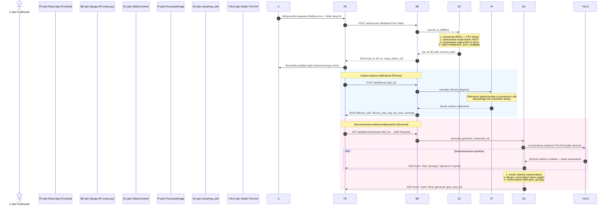

# Architektura Systemu — 4Diagnosis Computer Vision

Niniejszy dokument przedstawia szczegółową architekturę techniczną aplikacji **4Diagnosis Computer Vision** służącej do cyfrowej analizy biopsji nerek na obrazach wielkoformatowych (WSI — *Whole Slide Image*). Dokumentacja opisuje strukturę katalogów, formaty zapisywanych danych, schemat metadanych JSON, przepływ informacji, szczegółowe algorytmy procesorów graficznych (AI/CV) oraz integrację z frontendem.

---

## Spis Treści
1. [Wprowadzenie i Stos Technologiczny](#1-wprowadzenie-i-stos-technologiczny)
2. [Ogólna Architektura i Komunikacja](#2-ogólna-architektura-i-komunikacja)
3. [Struktura Plików na Backendzie](#3-struktura-plików-na-backendzie)
4. [Struktura Zapisywanych Plików Zadania (Job Storage)](#4-struktura-zapisywanych-plików-zadania-job-storage)
5. [Schemat i Struktura JSON z Metadanymi](#5-schemat-i-struktura-json-z-metadanymi)
6. [Szczegółowy Opis Modułów i Klas Backendowych](#6-szczegółowy-opis-modułów-i-klas-backendowych)
7. [Algorytmy i Procesory Obrazu (CV/AI)](#7-algorytmy-i-procesory-obrazu-cvai)
8. [Komunikacja API i Integracja z Frontendem](#8-komunikacja-api-i-integracja-z-frontendem)

---

## 1. Wprowadzenie i Stos Technologiczny

System **4Diagnosis Computer Vision** to zaawansowana aplikacja webowa do automatycznej oceny histopatologicznej preparatów nerek. Umożliwia wczytywanie skanów w formacie Mirax (`.mrxs`), automatyczne wykrywanie fragmentów tkanki (bioptatów/slices), mierzenie ich długości, ocenę stopnia zwłóknienia (fibrosis) metodą segmentacji barwnej oraz detekcję i klasyfikację kłębuszków nerkowych (glomeruli) przy użyciu modelu głębokiego uczenia YOLOv8 na pełnej rozdzielczości skanu.

### Stos Technologiczny
*   **Backend:**
    *   **Django Web Framework** (obsługa REST API, serwowanie plików, wielowątkowość).
    *   **OpenSlide Python** (niskopoziomowy odczyt kafelków ze skanów WSI w formacie MRXS).
    *   **OpenCV** (operacje na przestrzeniach barw HSV/LAB, morfologia, detekcja komponentów spójnych).
    *   **Scikit-Image** (szkieletyzacja tkanki, trasowanie ścieżek MCP — *Minimal Cost Path*).
    *   **PyTorch / Ultralytics YOLOv8** (model detekcyjny kłębuszków: `yolov8m_Ludzie01_classification_2026-05-31_oversample2x.pt`).
*   **Frontend:**
    *   **React + TypeScript + Vite** (interaktywny interfejs użytkownika).
    *   **HTML5 Canvas / SVG** (renderowanie kafelków detekcji i lokalizacji kłębuszków w czasie rzeczywistym).
    *   **Server-Sent Events (SSE)** (strumieniowanie wyników detekcji kłębuszków na żywo).

---

## 2. Ogólna Architektura i Komunikacja

Aplikacja jest podzielona na niezależną część serwerową (Django API) oraz kliencką (React Single Page App). 

Poniższy schemat obrazuje przepływ danych w systemie:



---

## 3. Struktura Plików na Backendzie

Logika aplikacji na backendzie jest zorganizowana w modularny sposób pod katalogiem aplikacji Django `myapp/`:

```
backend/cv/
├── manage.py                   # Plik startowy Django
├── db.sqlite3                  # Baza danych (opcjonalna, głównie bezstanowa)
├── cv/                         # Główny moduł konfiguracji Django
│   ├── settings.py             # Ustawienia Django (parametry algorytmów, ścieżki modeli)
│   ├── urls.py                 # Główne trasowanie adresów URL
│   └── wsgi.py
└── myapp/                      # Moduł główny aplikacji analizy obrazu
    ├── admin.py
    ├── apps.py
    ├── urls.py                 # Trasowanie API (/api/convert, /api/fibrosis, itd.)
    ├── views.py                # Kontrolery API (Django Views, deserializacja JSON, obsługa błędów)
    └── source/                 # Rdzeń przetwarzania obrazu i modeli matematycznych
        ├── __init__.py
        ├── slide_converter.py  # Koordynator konwersji i generowania metadanych
        ├── processed_image.py  # Fasada orkiestrująca wywołania analiz (Fibrosis, Length, Glomeruli)
        ├── streaming_utils.py  # Generator SSE dla detekcji kłębuszków, wątki robocze i scalanie cross-slice
        ├── model/              # Przechowalnia wag sieci neuronowych
        │   └── yolov8m_Ludzie01_classification_2026-05-31_oversample2x.pt
        └── processors/         # Indywidualne algorytmy przetwarzania i metadanych
            ├── __init__.py
            ├── converter_tiff.py       # Niskopoziomowa konwersja MRXS na piramidę TIFF z optymalnym kaflowaniem
            ├── mask.py                 # Segmentacja tkanki (HSV + operacje morfologiczne + komponenty spójne)
            ├── slice_grouper.py        # Klastrowanie przestrzenne fragmentów tkanki w spójne plasterki (slices)
            ├── metadata.py             # Definicje dataclass dla metadanych, zapis i odczyt JSON
            ├── tissue_length_processor.py # Pomiar fizycznej długości bioptatu (szkieletyzacja + MCP)
            ├── fibrosis_processor.py   # Wykrywanie zwłóknienia (przestrzeń LAB, kanał B)
            └── glomeruli_processor.py  # Wielowątkowy procesor detekcji YOLOv8 na kafelkach level-0 WSI
```

---

## 4. Struktura Zapisywanych Plików Zadania (Job Storage)

Podczas wczytania nowego pliku preparatu tworzony jest unikalny identyfikator UUID (`job_id`). Wszystkie pliki wejściowe, pośrednie i wyniki analiz zapisywane są w wydzielonym podkatalogu o nazwie odpowiadającej temu identyfikatorowi:

```
slides/
└── <job_id>/                                    # Katalog zadania (UUID v4)
    ├── Mallory.mrxs                             # Oryginalny plik wejściowy Mirax (skan WSI)
    ├── Mallory/                                 # Folder towarzyszący formatu Mirax z kafelkami danych
    │   ├── Index.dat                            # Indeks kafelków
    │   ├── Data0001.dat                         # Dane binarne obrazu
    │   └── Slidedat.ini                         # Plik konfiguracyjny skanu
    │
    ├── Mallory.tiff                             # Skompresowany, jednopoziomowy TIFF (obraz roboczy dev)
    ├── Mallory.json                             # Ujednolicone metadane zadania (szczegóły w rozdziale 5)
    ├── Mallory_mask.tiff                        # Binarna maska tkanki (tło = 0, tkanka = 255)
    │
    # --- Pliki podglądu ---
    ├── Mallory_origin_detect.tiff               # Crop reprezentacyjnego slice'a z białym tłem (główny preview)
    │
    # --- Pliki pośrednie i tymczasowe (analiza wsadowa) ---
    ├── Mallory_repr_crop.tiff                   # Crop reprezentacyjnego slice'a (tymczasowy do analizy)
    ├── Mallory_repr_crop_mask.tiff              # Maska wycięta dla reprezentanta
    ├── Mallory_slice0_crop.tiff                 # Crop slice 0 (generowany w trybie all-slices)
    ├── Mallory_slice1_crop.tiff                 # Crop slice 1 (generowany w trybie all-slices)
    │
    # --- Wizualizacje wyników analiz ---
    ├── Mallory_fibrosis.tiff                    # Obraz reprezentacyjny z nałożonym kolorem zielonym na zwłóknienia
    ├── Mallory_length.tiff                      # Obraz reprezentacyjny z nałożonym szkieletem (czerwony) i najdłuższą ścieżką (turkus)
    ├── glomeruli.json                           # Zapisana lista wykrytych kłębuszków (współrzędne i pewność)
    ├── Mallory_origin_detect_glomeruli.jpg      # Podgląd reprezentanta z narysowanymi bboxami kłębuszków
    └── glom_grid.jpg                            # Pozioma siatka porównawcza kłębuszków ze wszystkich plasterków (all-slices)
```

> [!NOTE]
> Pliki o nazwach typu `<stem>_slice{n}_crop.tiff` są tworzone jako pliki robocze na dysku podczas przetwarzania w trybie `all-slices` i służą do wydajnego przekazywania fragmentów obrazu do poszczególnych procesorów.

---

## 5. Schemat i Struktura JSON z Metadanymi

Plik `<stem>.json` jest kluczowym elementem bezstanowej architektury backendu. Zapisuje on pełne informacje kalibracyjne i przestrzenne po konwersji preparatu, eliminując potrzebę ciągłego odczytywania surowego pliku `.mrxs` przy kolejnych analizach.

### Opis Pól Dokumentu JSON
1.  **`source`**: Typ źródła obrazu (np. `"mrxs"`).
2.  **`source_path`**: Nazwa pliku źródłowego.
3.  **`calibration`**: Dane skali fizycznej odczytane z openslide:
    *   `source_mpp_x` / `source_mpp_y`: Rozdzielczość fizyczna skanu na poziomie 0 (mikrony na piksel — $\mu m/px$).
    *   `level`: Poziom piramidy MRXS użyty do wygenerowania obrazu roboczego TIFF (domyślnie `5`).
    *   `downsample`: Mnożnik pomniejszenia poziomu (np. $2^5 = 32.0$).
    *   `mpp_x` / `mpp_y`: Rzeczywista rozdzielczość piksela w wyjściowym pliku TIFF (`source_mpp * downsample`).
4.  **`scan`**: Informacje o geometrii skanu:
    *   `tiff_shape`: Wymiary wygenerowanego obrazu TIFF `[wysokość, szerokość]` w pikselach.
    *   `mrxs_level0_shape`: Wymiary oryginalnego skanu MRXS na poziomie 0 `[wysokość, szerokość]` w pikselach.
    *   `crop_offset_x` / `crop_offset_y`: Współrzędne przesunięcia (offset) w pikselach level-0, określające gdzie w oryginalnym pliku WSI zaczyna się wycięty obszar tkanki (usuwanie pustego marginesu białego tła podczas konwersji).
5.  **`slices`**: Lista plasterków tkanki zlokalizowanych na preparacie:
    *   `representative_slice_id`: Identyfikator plasterka wybranego jako reprezentacyjny (środkowy plasterek w układzie przestrzennym).
    *   `items`: Tablica obiektów plasterków. Każdy plasterek zawiera:
        *   `slice_id`: Unikalny numer plasterka.
        *   `is_representative`: Flaga logiczna oznaczająca reprezentanta.
        *   `bbox_tiff`: Bounding box plasterka w pikselach obrazu roboczego TIFF: `[x_min, y_min, szerokość, wysokość]`.
        *   `bbox_level0`: Bounding box plasterka w pikselach oryginalnego skanu (poziom 0): `[x_min, y_min, szerokość, wysokość]`.
        *   `area_tiff_px`: Pole powierzchni tkanki plasterka w pikselach na obrazie TIFF (suma pikseli maski).

### Przykład Pliku JSON Metadanych (`Mallory.json`):
```json
{
  "source": "mrxs",
  "source_path": "101110 Mallory.mrxs",
  "calibration": {
    "source_mpp_x": 0.121398698884758,
    "source_mpp_y": 0.121398698884758,
    "level": 5,
    "downsample": 32.0,
    "mpp_x": 3.884758364312256,
    "mpp_y": 3.884758364312256,
    "unit": "um_per_pixel"
  },
  "scan": {
    "tiff_shape": [
      6144,
      3072
    ],
    "mrxs_level0_shape": [
      412416,
      185856
    ],
    "crop_offset_x": 1024,
    "crop_offset_y": 3072
  },
  "slices": {
    "representative_slice_id": 1,
    "items": [
      {
        "slice_id": 0,
        "is_representative": false,
        "bbox_tiff": [
          913,
          693,
          1320,
          1353
        ],
        "bbox_level0": [
          61984,
          120480,
          42240,
          43296
        ],
        "area_tiff_px": 367682
      },
      {
        "slice_id": 1,
        "is_representative": true,
        "bbox_tiff": [
          1051,
          4468,
          1450,
          1240
        ],
        "bbox_level0": [
          66400,
          241280,
          46400,
          39680
        ],
        "area_tiff_px": 373509
      }
    ]
  }
}
```

---

## 6. Szczegółowy Opis Modułów i Klas Backendowych

### `SlideConverter` (w `slide_converter.py`)
Klasa zarządzająca pierwszym etapem przetwarzania:
*   Zapisuje przesłany plik `.mrxs` oraz jego pliki towarzyszące z folderu danych, dbając o wielkość znaków w nazwach plików (np. zamiana `index.dat` na `Index.dat` w celu kompatybilności z systemami Linux).
*   Deleguje konwersję do niskopoziomowego `SlideProcessor`.
*   Generuje binarną maskę tkanki na podstawie wyjściowego obrazu TIFF za pomocą funkcji `generate_mask`.
*   Używa klasy `SliceGrouper` do zgrupowania odseparowanych wysp tkanki w plasterki (np. w przypadku rozkawałkowania jednego bioptatu).
*   Oblicza parametry fizycznej kalibracji i geometryczne bounding boxy zarówno w układzie współrzędnych TIFF, jak i Level-0.
*   Zapisuje ujednolicony plik metadanych JSON oraz wycina obraz podglądu reprezentanta (`_generate_preview`).

### `SliceGrouper` (w `processors/slice_grouper.py`)
Algorytm grupujący wykryte komponenty spójne tkanki:
*   Wyznacza bounding boxy (`_bbox_from_mask`) i pola powierzchni wszystkich wykrytych komponentów tkanki.
*   Określa główny kierunek ułożenia tkanki (horyzontalny vs wertykalny) na podstawie rozpiętości współrzędnych.
*   Grupuje segmenty leżące blisko siebie wzdłuż osi układu (z tolerancją dynamiczną rzędu 8% całkowitej rozpiętości). Umożliwia to złączenie fragmentów tego samego plasterka, które uległy podziałowi mechanicznemu podczas przygotowania preparatu.
*   Wyznacza sumaryczny bounding box dla każdej grupy (plasterka), a następnie sortuje je w kolejności przestrzennej.
*   Wskazuje plasterek środkowy (`n // 2`) jako reprezentatywny.

### `ProcessedImage` (w `processed_image.py`)
Cienka fasada orkiestrująca, będąca punktem wejścia dla zapytań o analizę:
*   Odczytuje ujednolicony plik metadanych JSON z katalogu roboczego.
*   Rozstrzyga zakres analizy na podstawie konfiguracji `settings.SLICE_MODE` (`"one-slice"` lub `"all-slices"`):
    *   W trybie **one-slice**: wycina z głównego TIFFa wyłącznie prostokąt reprezentanta i przekazuje go do procesorów.
    *   W trybie **all-slices**: sekwencyjnie wycina fragmenty dla wszystkich zidentyfikowanych plasterków i agreguje wyniki.
*   Zapisuje pliki tymczasowe wycinków plasterków na dysku.

---

## 7. Detekcja kłębuszków nerkowych (`GlomeruliProcessor` / `YOLOv8`)
Detekcja jest realizowana na pełnej rozdzielczości (poziom 0 pliku MRXS), z racji małych rozmiarów kłębuszków w skali całego slajdu.

```
       [ Pętla po kafelkach preparatu na poziomie 0 (krok = tile_size - overlap) ]
                                          |
                                          v
                         +---------------------------------+
                         |  Szybki filtr miniaturki (1/32) | -- (Brak tkanki) --> [ Pomiń kafelek ]
                         |   (is_tissue_thumb >= 3% px)    |
                         +---------------------------------+
                                          | (Jest tkanka)
                                          v
                         +---------------------------------+
                         |   Filtr maski roboczej TIFF     | -- (Brak tkanki) --> [ Pomiń kafelek ]
                         | (is_tissue_in_tiff_mask >= 5%)  |
                         +---------------------------------+
                                          | (Jest tkanka)
                                          v
                         +---------------------------------+
                         | Odczyt kafelka z pliku MRXS     |
                         | (openslide.read_region)         |
                         +---------------------------------+
                                          |
                                          v
                         +---------------------------------+
                         |  Usuwanie tła wewnątrz kafelka  |
                         |     (_apply_tissue_mask)        |
                         +---------------------------------+
                                          |
                                          v
                         +---------------------------------+
                         | Zmiana wymiaru do 640x640 i     |
                         | predykcja pakietowa (batch) YOLO|
                         +---------------------------------+
                                          |
                                          v
                         +---------------------------------+
                         |  Przeliczenie współrzędnych     |
                         |  do układu globalnego level-0   |
                         +---------------------------------+
                                          |
                         +----------------+----------------+
                         |
                         v
       [ Koniec pętli - globalna deduplikacja NMS (Union-Find IoMin >= 0.3) ]
```

1.  **Dwuetapowa filtracja I/O (Pre-filtering):** Ponieważ odczyt regionów o wysokiej rozdzielczości z plików WSI jest kosztowny, każdy kafelek ($1024 \times 1024$ px) przed odczytem przechodzi przez dwa filtry:
    *   *Filtr miniaturki:* Sprawdza na załadowanej do pamięci miniaturce skanu (pomniejszenie 32-krotne), czy kafelek zawiera co najmniej 3% pikseli tkankowych (jasność w przedziale $[15, 230]$).
    *   *Filtr maski TIFF:* Mapuje współrzędne kafelka na maskę roboczą TIFF. Jeśli udział pikseli tkanki w masce dla danego kafelka jest mniejszy niż 5% (0.05), kafelek jest odrzucany.
2.  **Usuwanie szumów tła (`_apply_tissue_mask`):** Dla zakwalifikowanych kafelków odczytywany jest surowy obraz RGB z pliku MRXS. Na kafelku uruchamiany jest lokalny algorytm HSV maskowania tła, a wszystkie piksele sklasyfikowane jako szkło/tło są zamieniane na kolor biały `(255, 255, 255)`. Eliminuje to fałszywe detekcje YOLO na zabrudzeniach szkiełka lub napisach markerem.
3.  **Predykcja YOLOv8:** Obrazy kafelków są skalowane do rozmiaru sieci ($640 \times 640$ px), pakowane w paczki (batch) i poddawane predykcji. Wykryte ramki (bboxes) są skalowane z powrotem do wymiaru $1024 \times 1024$ i przesuwane o globalny offset kafelka na poziomie 0.
4.  **Deduplikacja bboxes (NMS przez Union-Find):** Kafelki nakładają się na siebie (overlap = 100 px). Aby scalić kłębuszki wykryte wielokrotnie na granicach kafelków, stosowany jest algorytm Union-Find oparty o współczynnik *Intersection over Minimum Area* (IoMin):
    $$\text{IoMin} = \frac{\text{Pole powierzchni przecięcia (A } \cap \text{ B)}}{\min(\text{Pole A}, \text{Pole B})}$$
    Jeśli IoMin $\ge 0.3$, detekcje są łączone w jedną grupę. Ostateczna ramka grupy obejmuje skrajne granice wszystkich ramek składowych (`[min(x1), min(y1), max(x2), max(y2)]`), a klasa i poziom pewności (`conf`) są dziedziczone po ramce o najwyższym współczynniku pewności w grupie.

---

## 8. Komunikacja API i Integracja z Frontendem

### 8.1 Punkty Końcowe (Endpoints) REST API
Wszystkie zapytania wysyłane są na adres bazowy `/api/`.

| Endpoint | Metoda | Opis | Payload (Request) | Response (Success) |
| :--- | :--- | :--- | :--- | :--- |
| `select-folder/` | `DELETE` | Czyści katalog roboczy `slides/` ze wszystkich zadań. | *Brak* | `{"status": "ok", "message": "Cleared..."}` |
| `convert/` | `POST` | Przesyła pliki preparatu, konwertuje MRXS do TIFF, tworzy metadane. | `multipart/form-data`<br/>Klucz `files`: lista plików (`.mrxs`, `.dat`, `.ini`) | `{"status": "ok", "job_id": "...", "tiff": "...", "tiff_url": "...", "origin_detect_url": "..."}` |
| `tiff/<job_id>/` | `GET` | Zwraca binarny strumień pliku TIFF preparatu. | *Brak* | *Binary file stream* (`image/tiff`) |
| `result-image/<job_id>/<img_name>/` | `GET` | Pobiera plik wizualizacji analizy z katalogu zadania (zabezpieczenie path traversal). | *Brak* | *Binary file stream* (`image/tiff` lub `image/jpeg`) |
| `fibrosis/` | `POST` | Uruchamia ocenę stopnia zwłóknienia. | `{"job_id": "..."}` | `{"job_id": "...", "fibrosis_ratio": 0.12, "fibrosis_ratio_avg": 0.11, "fibrosis_ratio_per_slice": [...], "fibrosis_warning": false, "fibrotic_pixels": 123, "tissue_pixels": 1000, "image_path": "..."}` |
| `length/` | `POST` | Uruchamia pomiar długości bioptatu. | `{"job_id": "..."}` | `{"job_id": "...", "length": 14.52, "image_path": "..."}` |
| `glomeruli/count/` | `POST` | Szybki synchroniczny podsumowujący odczyt liczby kłębuszków (fallback). | `{"job_id": "..."}` | `{"job_id": "...", "count": 25, "image_url": "...", "glom_grid_url": "..."}` |
| `glomeruli/stream/` | `GET` | Uruchamia strumieniowanie detekcji kłębuszków na żywo (SSE). | Zapytanie typu GET z parametrem `?job_id=...` | *Server-Sent Events Stream* (`text/event-stream`) |

---

### 8.2 Strumieniowanie Server-Sent Events (SSE) i Obsługa Wielu Plasterków
Gdy frontend nawiązuje połączenie z `/api/glomeruli/stream/?job_id=...`, backend uruchamia wielowątkowy generator strumienia. Działa on różnie w zależności od trybu pracy:

#### Tryb 1: `one-slice` (Strumieniowanie z jednego reprezentanta)
1.  Backend wysyła metadane startowe preparatu (`slide_info` ze współrzędnymi szerokości i wysokości).
2.  Tworzony jest pojedynczy obiekt klasy `GlomeruliProcessor` z obszarem skanowania (`scan_bbox`) ustawionym na bounding box reprezentanta.
3.  Detekcja jest uruchamiana w osobnym wątku roboczym:
    *   Wykrycie klocka kafelków powoduje wywołanie callbacku `on_tile`, który buforuje przeskanowane kafelki.
    *   Zakończenie predykcji paczki YOLO wywołuje `on_batch`, który wrzuca nowe detekcje kłębuszków do wątkowo bezpiecznej kolejki (`queue.Queue`).
4.  Główny wątek obsługujący połączenie SSE pobiera dane z kolejki i natychmiast wysyła je do frontendu w formacie JSON.
5.  Po zakończeniu wątku roboczego, na dysku zapisywany jest plik `glomeruli.json` i wysyłany jest event końcowy `done`.

#### Tryb 2: `all-slices` (Równoległe strumieniowanie i konsensus cross-slice)
Ten tryb pozwala na podgląd na żywo detekcji na reprezentancie, jednocześnie dokonując pełnej analizy pozostałych plasterków w tle.

```
       WĄTEK GŁÓWNY (SSE Connection)     |      WĄTEK REPREZENTANTA       |    WĄTKI INNYCH PLASTERKÓW
-----------------------------------------+--------------------------------+----------------------------------
 Uruchomienie połączenia GET             |                                |
 Wysyła Event: slide_info (n_slices=3)   |                                |
 Uruchomienie wątków pobocznych -------->| Uruchamia YOLO na Reprezentancie| Uruchamiają YOLO na pozostałych
                                         |                                | plasterkach w tle (cicho)
 Pętla pobierania z kolejki              |                                |
 Odbiera kafelki/kłębuszki <-------------| Wrzuca live postępy do kolejki |
 Wysyła Event: tiles / glomeruli         |                                |
                                         |                                |
 Odbiera Event: repr_finished <----------| Kończy pracę                   |
 Oczekiwanie na wątki tła (join) <-------+--------------------------------| Kończą pracę
                                                                          |
 Scalanie wyników (_merge_cross_slice)   |<-------------------------------+----------------------------------
 Generowanie siatki (_build_glomeruli_grid)
 Zapis merged glomeruli.json na dysk
 Wysyła Event: done {glom_grid_url}
 Zamknięcie strumienia SSE
```

##### Algorytm Scalania i Konsensusu (`_merge_cross_slice`):
Dla każdego kłębuszka wykrytego na plasterku reprezentacyjnym algorytm szuka jego odpowiedników na pozostałych plasterkach, wykorzystując kryterium odległości euklidesowej środków ramek (`GlomeruliProcessor.boxes_correspond` z tolerancją `tol_px` = 200 px w układzie level-0).
*   **Współczynnik Pewności Średniej (`conf_avg`):** Obliczany jako średnia z pewności detekcji we wszystkich plasterkach (jeśli na którymś plasterku brak dopasowania kłębuszka, do średniej przyjmuje się pewność `0.0`).
*   **Status Spójności (`status`):**
    *   Jeśli różnica między maksymalnym a minimalnym stopniem pewności detekcji w plasterkach jest mniejsza niż próg `settings.SLICE_GLOM_CONF_WARN_DIFF` (domyślnie `0.35`), kłębuszek otrzymuje status `"consistent"`.
    *   W przeciwnym wypadku otrzymuje status `"inconsistent"` (oznacza to znaczącą rozbieżność w obecności lub klasyfikacji struktury między plasterkami nacięcia biopsyjnego).

##### Generowanie Siatki Porównawczej (`_build_glomeruli_grid`):
Tworzony jest plik graficzny `glom_grid.jpg` łączący wycinki wszystkich zidentyfikowanych plasterków w jeden poziomy pas obrazu:
*   Na każdym plasterku rysowane są ramki detekcji kłębuszków.
*   Kolor ramki zależy od spójności: zielony `(0, 200, 0)` dla kłębuszków spójnych (`consistent`), pomarańczowy `(0, 140, 255)` dla niespójnych (`inconsistent`).
*   Na górze obrazu generowany jest pasek legendy informujący o znaczeniu kolorów.
*   Siatka jest skalowana pionowo do najmniejszej wysokości plasterka w celu zachowania estetyki.

---